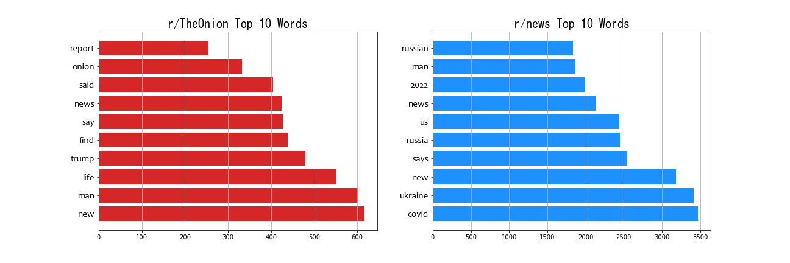
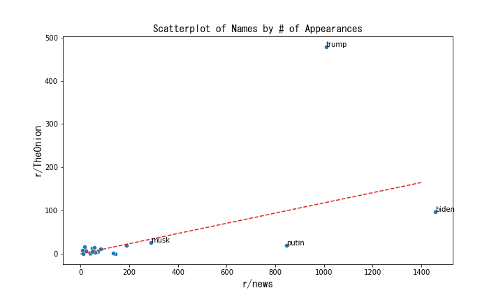

<h1 align="center"> Real News vs The Onion:
<br> Fake News Detection via Natural Language Processing </h1>

### Technical Note

We originally tried to include a copy of Stanford's GloVe model, an implementation of Word2Vec. Unfortunately the file was over 300 megabytes and more than 3x github's file size limits. If the reader wishes to fork this repo and run the code in notebook ```06-Word2Vec``` themselves, they will need to download a copy of Stanford's <a href='https://nlp.stanford.edu/projects/glove/'> GloVe 6b model</a> and place the file in the empty ```word2vec``` folder.

<br>

## Problem Statement

<br>

The purposes of this project is to explore the possibility of automated fake news detection using machine learning. Intelligent fake news detection is an ambitious and broad topic; a good starting point is the much more reasonable objective of classifying post titles between real news headlines and satirical headlines. Therefore the concrete goal of this project is to build a discriminator to classify posts between two subreddits: *r/news* and *r/TheOnion* using the post titles only.

While we cannot hope to completely solve the problem of fake news detection in this project alone, it is our belief that the models and concepts explored and demonstrated here are a good first step towards that ultimate goal.

<br>

---

<br>

## Background

<br>

The detection of fake news is interesting for many reasons. From a technical data science and machine learning perspective, the challenge lies in how to encode text data into usable numeric values (on which we can train models). *Natural Language Processing* or *NLP* is the theory of how to perform such encodings and this project constitutes a good exploration into the techniques and ideas of NLP. Central to the question of text-to-numeric encoding is how to preserve information carried by text datum such as grammer, context, and sentiment.

From a business perspective, fake news detection can identify misleading or blatantly false marketing campaigns designed to negatively sway public opinion. This is important when it comes to issues such as brand association, brand integrity, product reputation, and most importantly public relations.

For the purposes of this project we scraped text data from <a href='https://www.reddit.com/'> reddit </a>, which is an internet forum-style website where users post and comment on content of various topics. Reddit is segmented into sub-forums called "subreddits" with each subreddit specific to a singular topic. We will be scraping data from the subreddits <a href='https://www.reddit.com/r/news/'> r/news </a> and <a href='https://www.reddit.com/r/TheOnion/'>r/TheOnion </a>. The Onion is a satirical news website which publishes fake news articles for the purposes of humor and social commentary. We decided on The Onion as our standard for fake news since it is the most objective such benchmark (i.e. there is not much ambiguity in whether The Onion is considered real or fake news).

<br>

---

<br>

## Methodology

<br>

Our methodology can be broken down into 3 macro-level steps: 
1. Use webscraping to collect data from reddit.
2. Use various NLP techniques to transform the text datum into vector-valued datum.
3. Train models on the vector-valued data.

<br> 

### Step 1: Webscraping

Gathering the necessary data required scraping the aforementioned subreddits. We did so with the <a href='https://github.com/pushshift/api'> Pushshift API</a> which stores and tracks reddit posts and comments. Pushshift currently has a 500 post limit per server request, so we wrote a custom wrapper ```bifrost.py``` to automatically loop through multiple requests at 0.8s intervals thereby scraping all the necessary data. 

We attempted to scrape 100,000 posts from both *r/news* and *r/TheOnion*. We successfully did so for *r/news* but were only able to scrape 17,000 posts from *r/TheOnion*. We suspect that we might have scraped all the posts from *r/TheOnion*. This is worth keeping in mind since the posts from *r/news* are mostly recent news headlines (as of March 2022) while the posts from *r/TheOnion* maybe span across a few years.

After cleaning the data, the result was approximately 80,000 usable training examples with approximately 70,000 posts from *r/news* and 10,000 posts from *r/TheOnion*. This presented an interesting issue since the data science problem now became one of **imbalanced classes**; *r/news* posts outnumbered *r/TheOnion* posts at a ratio of over 7:1 which can lead to issues when evaluating our model's accuracy. We were thus faced with the decision of either: 1) preserving the imbalanced classes or 2) undersampling the majority class to get an even 50:50 split (i.e. throw away *r/news* posts until we have the same number as *r/TheOnion*). We decided to pursue both possibilities and built two rosters of models:
- Imbalanced Data: Naive Bayes, Logistic Regression, Linear SVM, and a Neural Network
- Balanced Data: Bagging Classifier with Trees, Random Forest, AdaBoost, and Gradient Boost.

Notice that the roster of models for the balanced data are comprised mostly of ensemble methods. This is because by undersampling the majority class, we drastically reduce the size of the training set. This makes ensemble classifiers a much more reasonable proposition given our time and hardware limitations. This is a major reason for why we decided to investigate the balanced class route in addition to the imbalanced class route.

<br>

### Step 2: Natural Language Processing

A **document** is a single training example of text datum (in our case a document is a post title). The **corpus** is the collection of all documents (the entire dataset). The **vocabulary** or **vocab** is the set of all words that appear in the corpus. In order to train our models, we must encode the text datum into vector datum. The methods of such encodings fall into the domain of Natural Language Processing or NLP. The 4 encoding methods we explore are:
1. Count Vectorization.
2. Term Frequence - Inverse Document Frequency (TF-IDF),
3. Sentiment Analysis (or SIA for short).
4. Word2Vec.

For the convenience of the reader, we give a brief summary of each of these encoding methods now. **Count Vectorization** simply creates a variable for each word in the vocabulary and counts the number of occurences of each word in a given document. Thus a document is encoded as the *count* of the words that appear in it.

**Term Frequence - Inverse Document Frequency** or TF-IDF augments the count vectorization encoding by also adding an "rarity" factor to each word. The idea is that words which show up very rarely actually carry the most information (and hence should be given more weight). For example, seeing a word like "welcome" does not tell us much since it appears in so many contexts, but seeing the word "soliloquy" tells us a lot since it is a rare word with a very specific usage.

**Sentiment Intensity Analysis** (or SIA for short) assigns each word a value called a *polarity score*. Polarity scores correspond a feeling of "positive" or "negative" associated to each word. For example a word like "horrors" would have a high negative score, while a word like "elegant" would have a high positive score. Each document is assigned an overall polarity vector by measuring the polarity of each of its words.

**Word2Vec** is an assignment of a word to a vector such that words who are close in meaning are also close as vectors. Closeness for vectors is measured by the cosine of their angle. For example, if the word "dog" is assigned to the vector < 1 ,2, 3 > then the word "wolf" might be assigned to the vector < 1, 2 , 3.1 >. The actual process of arriving at an assignment scheme requires a technical explanation but in a nutshell: words are randomly assigned first, then progressively moved closer or further using some loss function as an optimization objective.

To encode a document using Word2Vec, we first encode each word to its assigned vector, then just concantenate all the vectors. This gives us a single long vector for each document which can be fed into a training model like any of the other encodings.

<br>

### Step 3: Training the Models

As mentioned above, the model training procedure is split into two rosters based on two different data sets: imbalanced data and balanced data.

For the imbalanced data, we have 80,000 training examples with a 7:1 ratio of negatives to positive cases (*r/TheOnion* posts are treated as the positive class). This imbalance of classes yields a baseline accuracy of 87%, which is the accuracy any model can achieve by just randomly guessing the 0 class (*r/news*) for every single prediction. This is obviously bad since it means that a "high" accuracy score might not be reflective of the model's actual performance.
For this reason, we also pay close attention to Recall, Precesion, F1, and AUC scores. 

For the balanced data, we have 20,000 training examples with a perfect 1:1 ratio of negatives to positive cases. Since we reduced the number of training examples significantly, it now becomes feasible to explore ensemble methods on the data and we indeed do so.

In a addition to the usual suspects of ML models, we also implement a simple Neural Network with 1 hidden layer and 2000 hidden units, which we refer to as "OnionNet".

After all models have been built and a single "best model" has been selected, we score it against one final hold-out test set to evaluate this overall project's efficient. We then proceed to train a finalized model on all data points.


<br>

---

<br>

## Summary of Results

<br>

Some exploratory data analysis revealed that "current event topics" generally dominate *r/news* posts much more so than *r/TheOnion* articles. Of the top 10 most frequent words in *r/news* (as of March 2022), 3 of them are "Russia", "Russian", and "Ukraine". "Covid" also still seems to be a trending news headline as well.



We also investigated the names of prominent people, both political and celebrity figures.

  

As for the models themselves, we trained two different rosters of models for each of the imbalanced data set and balanced data set. We give a tabular summary of their metrics. Note that the "Baseline" model corresponds to just randomly guessing y = 0 (i.e. guessing *r/news*) for every single prediction.

<br>

|Imbalanced Data|
| :-: |

| Best Models | Accuracy | Recall | Precision | F1 | AUC |
| --- | --- | --- | --- | --- | --- |
|Baseline | 87% | - | - | - | 0.5 |
| Naive Bayes (Count Vector) | 93% | 59% | 78% | 67% | 0.93 |
|Logistic Regresion (TF-IDF)| 93.3% | 57% | 85% | 69% | 0.94 |
|Linear SVM (TF-IDF) | 93.4% | 56% | 87% | 67% | 0.94|
|OnionNet| 90.7% | 52% | 67% | 58% | - |

<br>

|Balanced Data|
| :-: |

| Models | Accuracy | Recall | Precision | F1 | AUC |
| --- | --- | --- | --- | --- | --- |
|Baseline | 50% | - | - | - | 0.5 |
|SVM (rbf kernel) | 76% | 93% | 70% | 80% | 0.88 |
| Bagging Trees | 72% | 63% | 77% | 69% | 0.80 |
| Random Forest | 79% | 73% | 83% | 78% | 0.89|
| AdaBoost| 72% | 72% | 72% | 72% | 0.78 |
|Gradient Boosted Trees| 78% | 75% | 80% | 77% | 0.87
|OnionNet| 81% | 84% | 80% | 82% | - |


<br>

For the imbalanced data, Linear SVM with TF-IDF encoding is the model we select as the overall best performing model. While Logistic Regression has almost identical accuracy, the Linear SVM has a slightly higher precision, which we believe is important when it comes to fake news detection. It is our opinion that a false negative (fake news slipping past as real) is preferable to a false positive (real news being flagged as fake). On the final test set, the model scored a solid 93.9% accuracy with 86% precision (AUC=0.95).

For balanced data, OnionNet slightly outperformed all the ensemble methods even though it was only trained on 10 epochs. We are suspicious of this result and until we can replicate OnionNet's accuracy on another data set, we do not feel confident saying it is the best performing model. For this reason, we select the Random Forest model based on it's validation accuracy and good precision score.

<br>

---

## Conclusion

<br>

In conclusion this project implemented a host of different models and NLP techniques. Various models were tried and overall, we feel confident in saying that most models performed above the baseline accuracy threshold. This indicates that there is potential for growth by either using more data, better data, or more sophisticated NLP techniques. Based on the results of the models trained, we do believe it is possible to intelligently detect satircal/fake news headlines using NLP and machine learning. We offer some suggestions for future directions this project can go:

<br>

1. We suspect that OnionNet can in fact work better than Logistic Regression in the imbalanced case if we fine tune the learning rate and regularizaiton rate. At the moment, our implementation of Word2Vec ignores the significance of people names which is a very important piece of information. This can be fixed by finding a better way to handle people names.

<br>

2. Since sentence structure matters, it might be a good idea to try a convolutional neural network on the Word2Vec implementation to learn the sentence structure by finding patterns to how certain words appear  in sequence.

<br>

3. The Ensemble Methods we tried all produce significantly overfit models. We can reel in some of this variance by investing more time tuning hyperparameters. At the moment, our hardware limitations make large grid searchs over these ensemble models unfeasible, but we might be able to deal with this issue using cloud computing.

<br>

4. Instead performing an automated webscrape of reddit, we can try instead to find cleaner and better labeled data from other sources. One possible idea: scrape The Onion website directly.

Finally, let us end by saying that this project was primarily sold as a fake news detection project but it is important to keep in mind that The Onion is satire. At the moment, machine learning classification on satirical text and humor in general is not well understood and an active, exciting area of research in NLP. We are very much interested in exploring the possibilities in this area of machine learning.